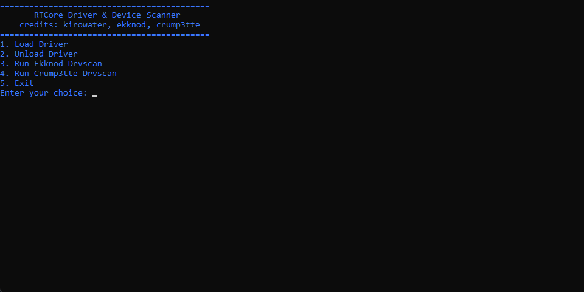

# drvscan-loader

## Credits
- **ekknod**: [drvscan](https://github.com/ekknod/drvscan)
- **crump3tte**: [drvscan-interrupt-info](https://github.com/Crump3tte/drvscan-interrupt-info)

## Features
- Simple to use for those who can't compile the code themselves.

## Installation

1. Download the repository.
2. Make sure all files are in the same folder.
3. Run the loader as **Administrator**.

## Preview

